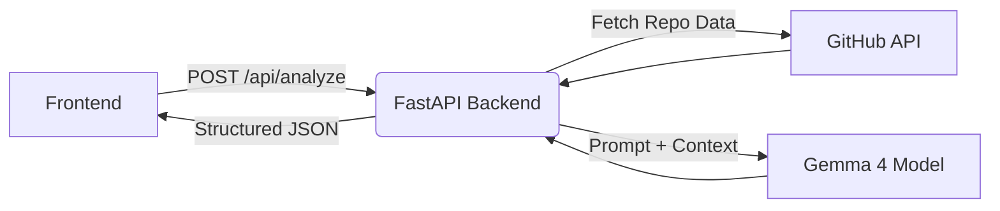

# OSContro

OSContro (Open Source Contributor) is a hackathon MVP that helps developers find beginner-friendly contribution opportunities in open-source GitHub repositories. It uses **Gemma 4** through the Google Gemini API to analyze repository architectures and even diagnose UI bugs from screenshots.

## Architecture

The project is split into two halves:
- **Backend:** A FastAPI server (in `backend/`) that fetches repository data from GitHub, compresses the context, and queries the Gemma 4 model.
- **Frontend:** A web application (in `frontend/`) that allows users to submit a GitHub URL and optional screenshot, and displays the structured JSON response.

## Using the Agent Skill

This repository includes a portable Agent Skill called **Contributor Compass** located at `.agents/skills/contributor-compass/SKILL.md`.

You can use this skill with any compatible AI agent by pointing it to this repository. When activated, the agent will act as an open-source guide:
1. Provide the agent with a GitHub repository URL (and optionally a screenshot of a bug).
2. The agent will inspect the repository's files, README, and issues.
3. It will explain the architecture and suggest 3 concrete, beginner-friendly starter issues grounded in real evidence.

## Setup

See `backend/README.md` for backend setup instructions.
